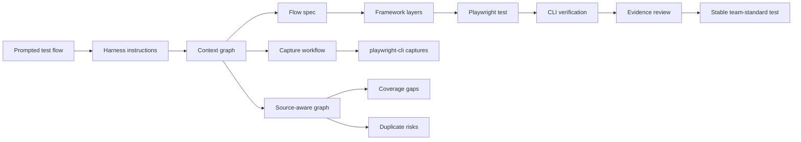
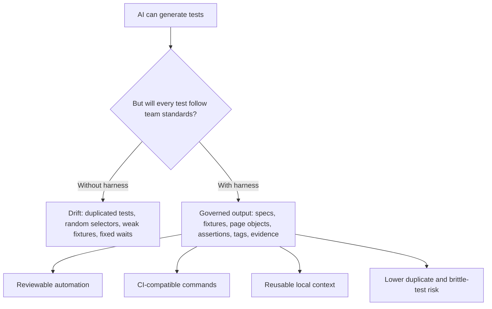
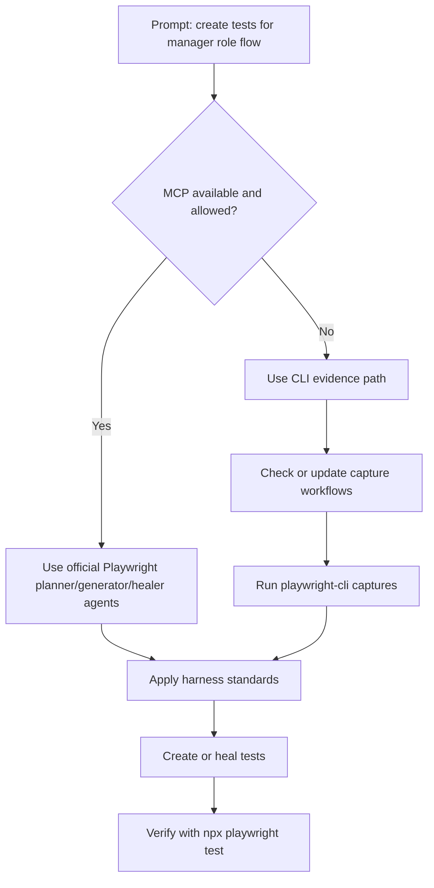
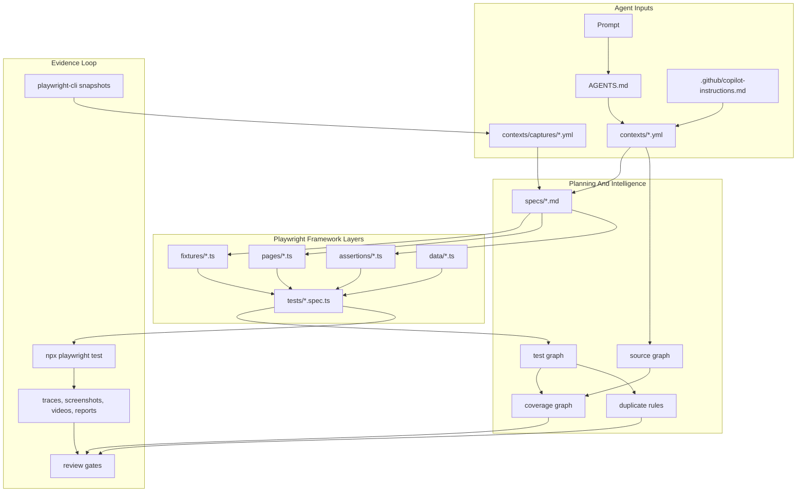
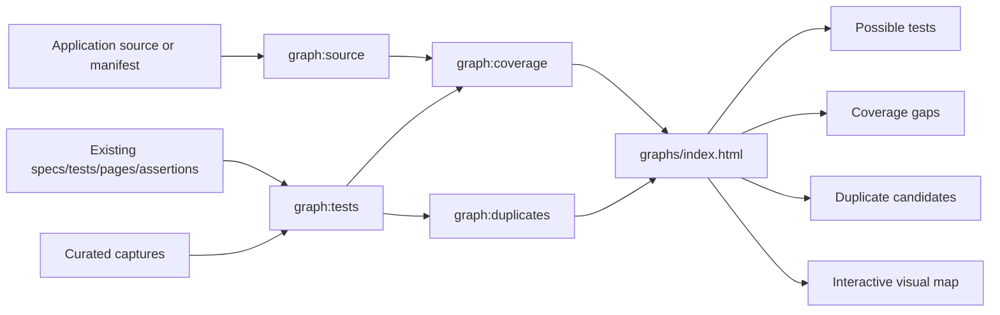
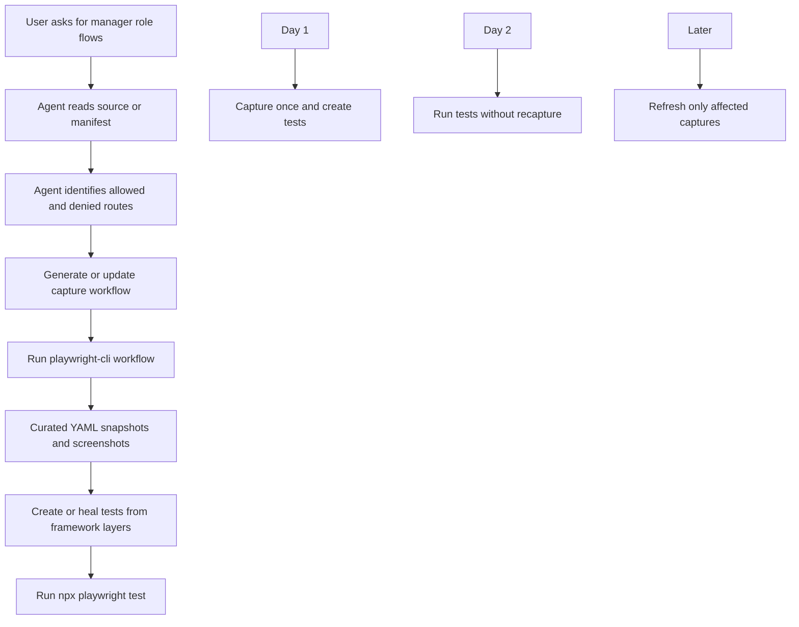
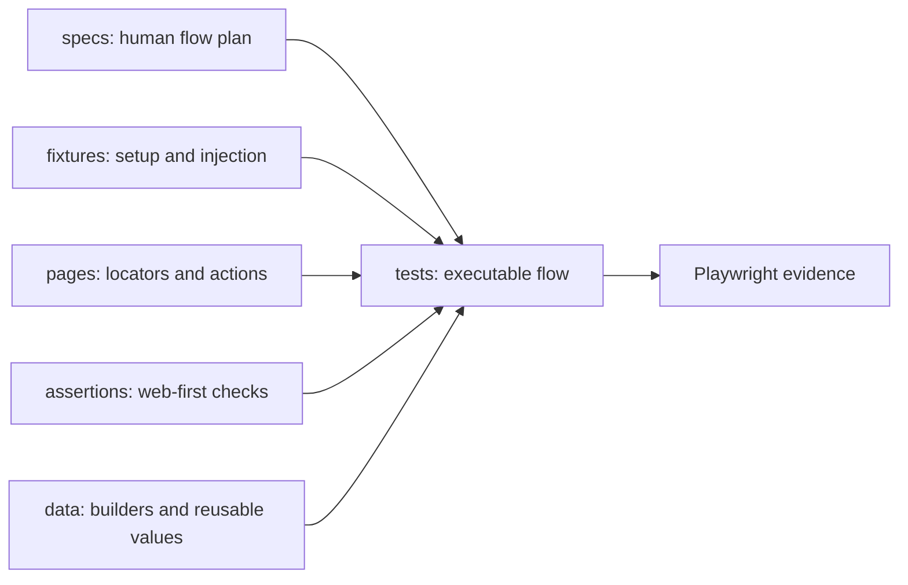
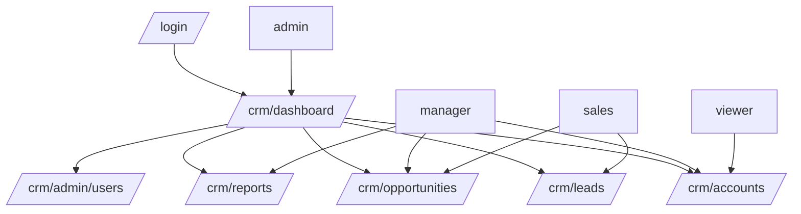
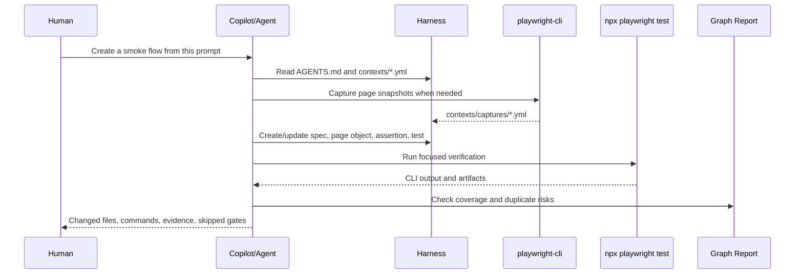
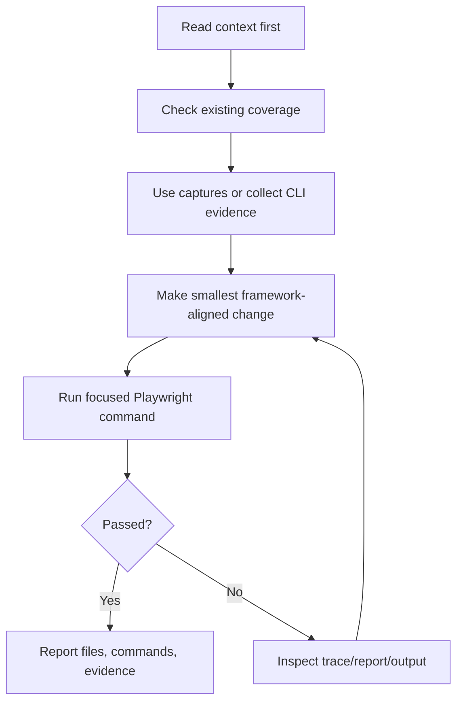

# Agentic Playwright Harness

> A visual-first, enterprise-ready standardization layer for AI-assisted
> Playwright automation with Copilot, official Playwright Agents, Playwright
> CLI evidence, and source-aware graph intelligence.


## What This Project Does



This harness helps teams turn plain-English test prompts into Playwright tests
that follow the same project rules every time.

## Why It Exists



The goal is not just faster test creation. The goal is consistent, reviewable,
and maintainable Playwright automation across a team.

## Prompt Mode Router


Every prompt starts with the same decision:



So MCP-enabled projects use official Playwright Agents for richer exploration,
while MCP-blocked projects use capture workflows and CLI evidence. Both paths
still follow the same team framework rules.

## Two Operating Modes

| Mode 1: MCP + Official Playwright Agents | Mode 2: No MCP + CLI Evidence |
| --- | --- |
| Use official Playwright planner, generator, and healer agents when teams have MCP access. The harness still controls standards and review gates. | Use Copilot or a coding agent with `playwright-cli` captures and `npx playwright test` evidence when MCP is blocked. |
|  |  |

## Core Architecture



## Source-Aware Graph Intelligence




The generated `graphs/index.html` report is tabbed so users can inspect one
view at a time: Overview Map, Route Coverage, Gaps & Duplicates, Candidate
Tests, and Graph Inputs. The tabs can also be opened directly with hashes such
as `graphs/index.html#coverage` or `graphs/index.html#candidates`.

## Source Manifest Sync

The graph layer is intentionally generic. It consumes a source manifest with
routes, roles, actions, fields, states, auth context, and test IDs. The harness
does not require every application to look like the sample CRM app.

This repo includes two adapter paths:

```text
scripts/source-adapters/generic-source.mjs
scripts/source-adapters/sample-crm.mjs
```

The generic scanner creates a first-pass manifest by scanning common React,
Next, Angular, Vue, plain HTML, Spring Boot, and .NET source patterns. It looks
for routes, route files, controller mappings, links, labels, buttons, test IDs,
forms, visible states, and role/guard hints.

The recommended day-to-day model is:

```text
generic scanner creates baseline manifest
-> agent reviews source, tests, captures, and graph gaps
-> agent enriches missing auth, roles, states, and workflow intent
-> capture workflow becomes curated reusable page context
-> Playwright tests verify behavior
```

Start here when a consuming team has source access:

```bash
npm run source:manifest -- --root=path/to/app --output=source-manifest.json --url=http://localhost:3000 --name=my-app
```

Real teams can then enrich the manifest, or generate it from their own route
config, design system metadata, feature flags, or test data model.

Useful commands:

```bash
npm run source:manifest
npm run source:manifest:check
npm run source:manifest:crm
npm run source:manifest:crm:check
```

In this repository, `npm run source:manifest` uses the common scanner file:

```text
scripts/source-adapters/generic-source.mjs
```

The optional sample CRM demo uses the richer CRM adapter through
`npm run source:manifest:crm`.

Customization options:

| Option | Use |
| --- | --- |
| `SOURCE_MANIFEST=path/to/source-manifest.json` | Choose the manifest consumed by graph and capture scripts |
| `SOURCE_MANIFEST_ADAPTER=generic-source` | Explicitly use the common scanner adapter |
| `SOURCE_MANIFEST_ADAPTER=path/to/adapter.mjs` | Use a custom precision adapter that exports `buildManifest()` |
| `SOURCE_MANIFEST_COMMAND="npm run app:manifest"` | Optional advanced path when a team already owns a manifest generator |
| `SOURCE_MANIFEST_SYNC=0` | Disable automatic manifest sync |

The test, graph, and capture workflow scripts refresh the manifest first for
the sample app. In a real project, point the sync command at the application’s
source root so source changes are reflected before graph review and test
execution. Use the generic scanner as the baseline, and use app-specific
generation only when teams need exact auth, role, feature flag, or dynamic-state
semantics.

The scanner reduces the blank-page problem for new teams. It should not replace
agent review or team-owned business knowledge.

Before/after graph-loop evidence for the manager role flow:

| Before Manager Flow | After Manager Flow |
| --- | --- |
|  |  |

Evidence pack:
[`docs/evidence/manager-flow-graph-loop/README.md`](docs/evidence/manager-flow-graph-loop/README.md)

The image above is an example snapshot. The actual graph data is regenerated
from the current source manifest, tests, page objects, assertions, tags, and
captures every time the graph command runs.

| Signal | Meaning |
| --- | --- |
| Source routes | Computed from the app source or source manifest |
| Covered routes | Computed from existing Playwright specs and tests |
| Candidate tests | Computed from routes, roles, actions, states, and validations |
| Coverage gaps | Computed from source candidates minus existing coverage |
| Duplicate/overlap risks | Computed from flow intent, role, route, action, assertion, and tags |
| Visual graph nodes | Computed from source, tests, captures, gaps, and duplicates |
| Visual graph edges | Computed from relationships between those nodes |

Generate the report:

```bash
npm run graph:view
```

Open:

```text
graphs/index.html
```

## Capture Workflow


This is the practical day-to-day loop for role-based prompts.



The user does not need to memorize every low-level `playwright-cli` command.
For the sample CRM manager role, the agent or user can run the workflow
commands. Internally, these workflows are stored as YAML recipes in
`contexts/capture-recipes.yml`:

```bash
npm run capture:recipes:generate
npm run capture:recipe -- --list
npm run capture:crm:manager -- --dry-run
npm run capture:crm:manager
```

Then generate or heal tests from the captured page context and verify with:

```bash
APP_BASE_URL=http://127.0.0.1:4173 npm run sample:crm:test
```

## Framework Layers



| Folder | Purpose |
| --- | --- |
| `specs/` | Human-readable flow plans |
| `tests/` | Executable Playwright specs |
| `fixtures/` | Typed fixtures, auth, browser context, page instantiation |
| `pages/` | Page objects, stable locators, user actions |
| `assertions/` | Reusable web-first expectations |
| `data/` | Test data builders |
| `contexts/` | Agent rules, command maps, graph rules, capture catalog |
| `scripts/` | Source/test/coverage/duplicate graph generation |
| `examples/sample-crm-app/` | Optional demo app only |

## Sample CRM Demo App

The CRM app is included only to demonstrate how source-aware graph intelligence
works. Teams can replace it with their own application source or manifest.


Demo routes:



## How Teams Use It



## Quick Start

```bash
npm install
npm run typecheck
npm test
```

Optional global page-capture CLI:

```bash
npm install -g @playwright/cli@latest
playwright-cli --help
```

Run the sample CRM app:

```bash
npm run sample:crm
```

Run the CRM sample tests:

```bash
APP_BASE_URL=http://127.0.0.1:4173 npm run sample:crm:test
```

Generate the graph view:

```bash
npm run graph:view
```

Serve the graph view:

```bash
npm run graph:serve
```

## Command Map

| Command | Use |
| --- | --- |
| `npm test` | Full Playwright harness gate |
| `npm run test:smoke` | Smoke-tagged tests |
| `npm run typecheck` | TypeScript validation |
| `npm run source:manifest -- --root=path/to/app --output=source-manifest.json` | Create a first-pass manifest with the common scanner |
| `npm run source:manifest:check -- --root=path/to/app --output=source-manifest.json` | Fail if the scanner manifest is stale |
| `npm run source:manifest:crm` | Regenerate the richer sample CRM manifest |
| `npm run sample:crm` | Start optional CRM demo app |
| `APP_BASE_URL=http://127.0.0.1:4173 npm run sample:crm:test` | Run CRM sample tests |
| `npm run capture:recipes:generate` | Refresh the source manifest, then generate capture workflows |
| `npm run capture:recipe -- --list` | List available capture workflows |
| `npm run capture:crm:manager -- --dry-run` | Preview manager role captures |
| `npm run capture:crm:manager` | Capture manager allowed and denied page states |
| `npm run graph:view` | Generate source/test/coverage/duplicate graph report |
| `npm run graph:serve` | Serve interactive graph locally |

## Agent Rules At A Glance



Core rules:

- MCP is optional, not required.
- Use accessible locators first, then stable test IDs.
- Keep actions in page objects and expectations in assertion helpers.
- Use fixtures for shared setup and page instantiation.
- Avoid fixed waits.
- Verify with Playwright CLI/test-runner evidence.
- Check graph coverage and duplicate risks before adding broad tests.

## Longer Explanations

- Blog draft: [`docs/blog/agentic-playwright-harness-medium-draft.md`](docs/blog/agentic-playwright-harness-medium-draft.md)
- Overview deck: [`Agentic-Playwright-Harness-Copilot-CLI.pptx`](Agentic-Playwright-Harness-Copilot-CLI.pptx)
- Agent instructions: [`AGENTS.md`](AGENTS.md)
- Copilot instructions: [`.github/copilot-instructions.md`](.github/copilot-instructions.md)

## References

- [Playwright Test Agents](https://playwright.dev/docs/test-agents)
- [Playwright MCP](https://playwright.dev/docs/getting-started-mcp)
- [Playwright Agent CLI](https://playwright.dev/docs/getting-started-cli)
- [Playwright authentication](https://playwright.dev/docs/auth)
- [Playwright fixtures](https://playwright.dev/docs/test-fixtures)
- [Playwright annotations and tags](https://playwright.dev/docs/test-annotations)
- [Playwright CLI](https://playwright.dev/docs/test-cli)
