# Building an Agentic Playwright Harness for Practical Team Automation

## How teams can use short prompts, CLI evidence, optional MCP agents, capture workflows, and coverage graphs to discover, create, and govern Playwright tests

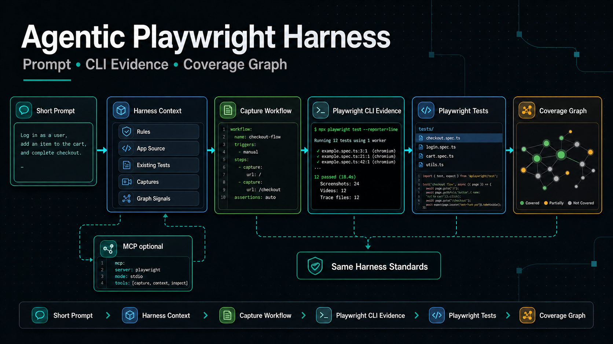

AI can already generate Playwright tests.

That is useful, but it is not enough for a real QA or engineering team.

The bigger day-to-day problem is this:

> Can every agent-generated test follow the same project standards, use the same
> fixtures, avoid duplicate coverage, reuse page context, and prove itself with
> Playwright evidence?

That is why we created an **Agentic Playwright Harness**.

The harness is not a replacement for Playwright, Copilot, or official
Playwright Agents. It is a project standardization layer around them.

It gives teams a repeatable way to move from a prompt to a maintainable
Playwright test using:

- project-local agent instructions
- MCP-optional prompt routing
- capture workflows
- curated `playwright-cli` YAML snapshots and screenshots
- fixtures, page objects, assertions, and data builders
- tag-based Playwright execution
- trace-first debugging
- source-aware graph reports

Reference implementation:
https://github.com/balajiregt/playwright-harness-framework


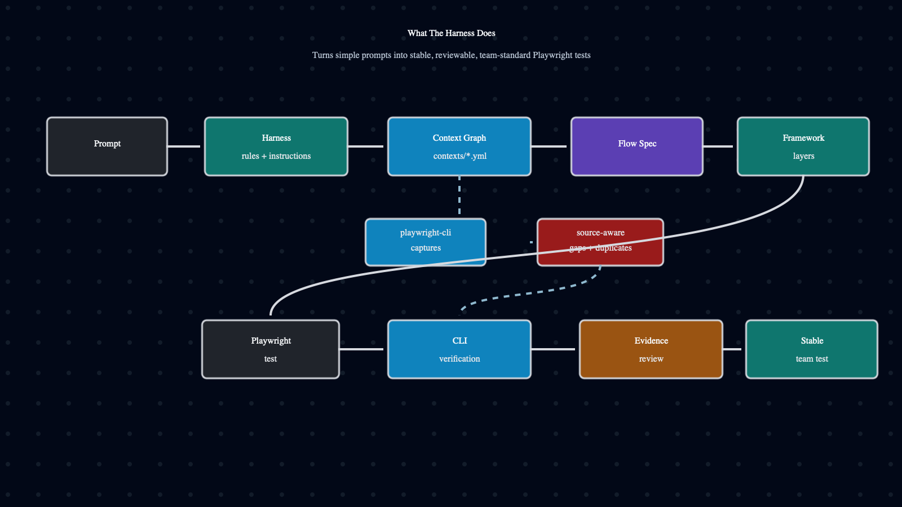

## The Problem We Were Solving

Most teams do not want to write long procedural prompts.

They want to give a short intent:

```text
Use the harness to add manager role CRM coverage.
```

The harness should expand that intent into the right workflow: check MCP access,
inspect existing coverage, use Playwright Agents or capture workflows, reuse
framework layers, run focused tests, update the graph, and report evidence.

Without a harness, an agent may still create a test, but the output can drift:

- selectors inside specs instead of page objects
- repeated login setup in every file
- mixed actions and assertions
- inconsistent tags
- duplicate tests for the same route
- fixed waits to hide timing issues
- tests created without checking existing coverage
- failures fixed without looking at traces or screenshots

The result is not faster automation. It is faster inconsistency.

The harness makes the agent behave like a team member who knows the project
rules before touching the test suite.

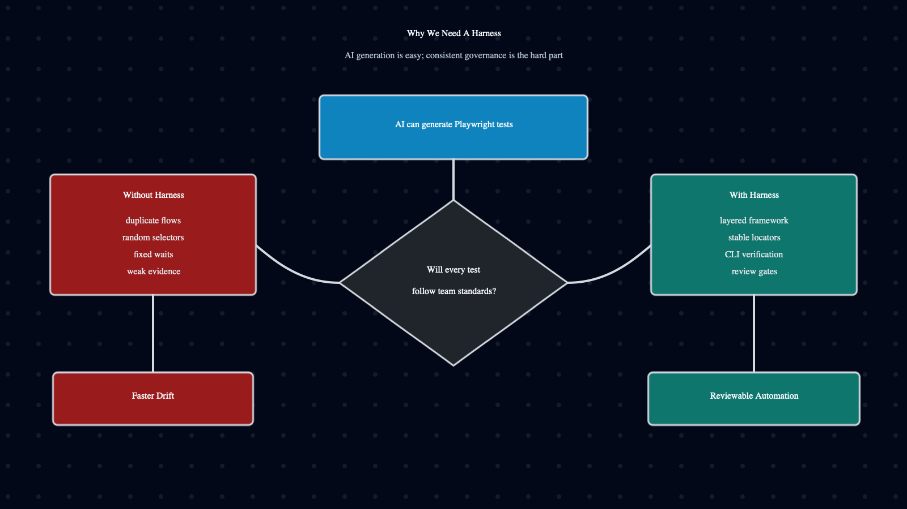

## The Everyday Workflow

The most important part of this harness is the flow.

When a user gives a prompt, the agent should not immediately start writing a
test. It should first choose the right operating mode.

```text
Prompt: create tests for manager role flow
  -> check whether MCP is available and allowed
  -> if yes, use official Playwright Agents for exploration or healing
  -> if no, use capture workflows and Playwright CLI evidence
  -> in both paths, follow the same harness standards
  -> verify with npx playwright test
```

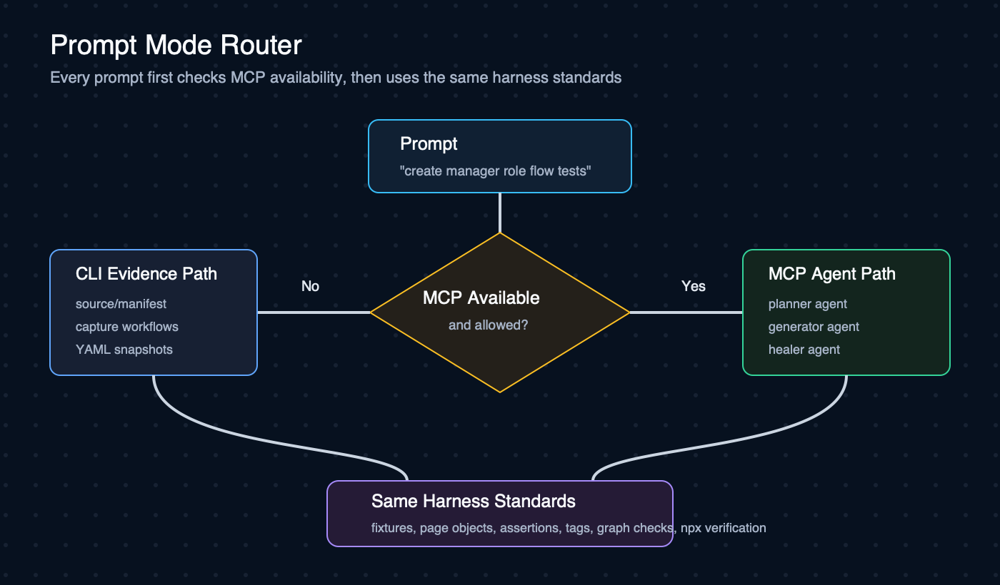

This is the key idea: **MCP changes how the agent explores the app, not how the
team structures the tests.**

## Mode 1: MCP Available

If a team has access to MCP and official Playwright Agents, they should use
them.

In that mode, Playwright planner, generator, and healer agents can help with
live exploration, test generation, and failure repair.

One important note: this repository is designed to support the MCP-enabled
path, but the hands-on validation for this version focused on the CLI mode. The
MCP path should be treated as an integration mode around official Playwright
Agents, not as the part this sample repo proves end to end.

The harness still adds value because it defines the team rules:

- where specs go
- where executable tests go
- how fixtures instantiate pages
- how page objects expose actions
- how assertion helpers verify behavior
- which tags are allowed
- how auth should be handled
- how duplicate coverage is checked
- which Playwright command proves the change

So the model is:

```text
Official Playwright Agents
  + MCP browser context
  + Harness standards
  + Playwright test verification
  = faster generation with team governance
```

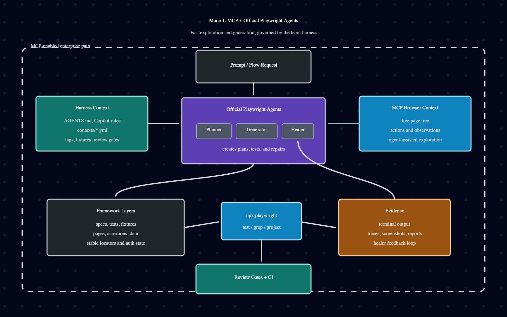

## Mode 2: MCP Not Available

In many organizations, MCP access is blocked inside Copilot Agent Mode or local
agent setups.

That should not stop prompt-based Playwright automation.

In this mode, the harness uses:

- Copilot Agent Mode or another coding agent
- global `@playwright/cli` for page-context capture
- capture workflows for repeatable role and flow snapshots
- project-local `npx playwright test` for verification
- Playwright traces, screenshots, reports, and terminal output for debugging

The model is:

```text
Prompt
  + local context files
  + capture workflows
  + playwright-cli snapshots
  + npx playwright test
  + trace/report evidence
  = no-MCP agentic Playwright workflow
```

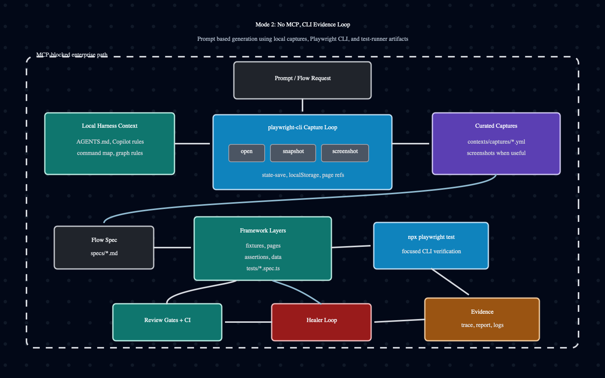

## Capture Workflows: The Practical CLI Layer

Raw `playwright-cli` commands are powerful, but they are not a great daily
workflow for every engineer.

Most users should not have to remember:

```bash
playwright-cli open http://127.0.0.1:4173/login
playwright-cli localstorage-set ...
playwright-cli goto http://127.0.0.1:4173/crm/accounts
playwright-cli snapshot --filename=contexts/captures/crm-manager-accounts-loaded.yml
```

Instead, the harness uses **capture workflows**.

A capture workflow describes the app URL, user/role context, routes to visit,
expected allowed or denied states, and which snapshots or screenshots should be
saved. Internally, these workflows are defined as YAML recipes in
`contexts/capture-recipes.yml`; the human-facing concept is the workflow.

For example, a manager role capture workflow can capture:

- dashboard loaded
- accounts loaded
- opportunities loaded
- reports error state
- leads permission denied
- admin users permission denied

The daily command sequence becomes:

```bash
npm run capture:recipes:generate
npm run capture:recipe -- --list
npm run capture:crm:manager -- --dry-run
npm run capture:crm:manager
```

Raw `playwright-cli open`, `snapshot`, and `screenshot` commands still exist,
but they are mainly for one-off exploration. The standard team path should be
workflow-first.

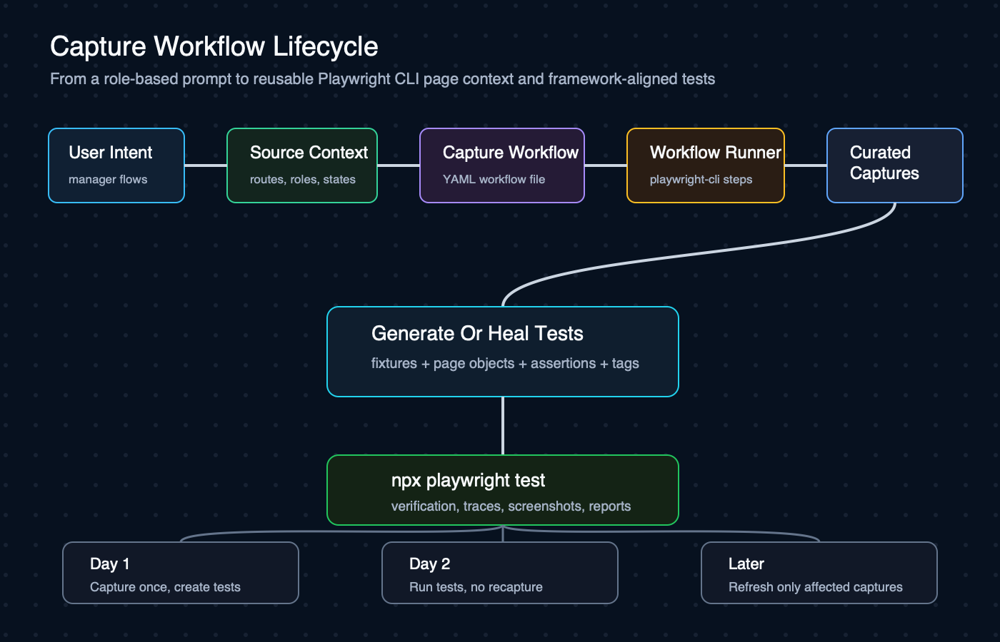

## Day 1, Day 2, And Later

This is how the workflow looks in a real project.

## Day 1: Add A New Flow

A user asks:

```text
Create manager role flow tests and assert which buttons are accessible and not
accessible.
```

The agent should:

1. Read `AGENTS.md`, Copilot instructions, command map, capture map, and test
   strategy.
2. Check whether MCP is available.
3. Read source or source manifest when available.
4. Check existing specs, tests, page objects, assertions, and captures.
5. Generate or update the manager capture workflow.
6. Preview the workflow.
7. Run the workflow to collect curated captures.
8. Add the smallest page-object and assertion helpers needed.
9. Add focused tests with the right tags.
10. Run the focused Playwright command.
11. Regenerate the graph report.
12. Report files changed, commands run, evidence used, and remaining gaps.

## Day 2: Run The Existing Tests

The team should not recapture everything every day.

Once captures are curated and tests exist, the normal flow is simply:

```bash
npm test
npm run test:smoke
APP_BASE_URL=http://127.0.0.1:4173 npm run sample:crm:test
```

Captures are context, not verification. Playwright tests are the verification
gate.

## Later: Refresh Only What Changed

If a page changes, a permission changes, or a test fails, the agent should not
refresh the entire application.

It should refresh only the affected capture:

```text
Failure on manager reports page
  -> inspect Playwright output and trace
  -> check existing reports capture
  -> refresh manager reports capture if stale
  -> fix the owning layer
  -> rerun the focused test
```

That keeps the loop fast and reduces unnecessary context churn.

## The Framework Layers

The harness keeps generated work in predictable places:

| Layer | Purpose |
| --- | --- |
| `AGENTS.md` and `.github/copilot-instructions.md` | Tell agents how to behave |
| `contexts/*.yml` | Store command, strategy, graph, loop, and capture rules |
| `contexts/capture-recipes.yml` | Defines repeatable capture workflows as YAML recipes |
| `contexts/captures/` | Stores curated page context |
| `specs/` | Human-readable flow plans |
| `fixtures/` | Shared setup, auth, browser context, page instantiation |
| `pages/` | Locators and user actions |
| `assertions/` | Reusable web-first expectations |
| `data/` | Test data builders |
| `tests/` | Executable Playwright specs |
| `graphs/` | Generated source, coverage, duplicate, and visual reports |

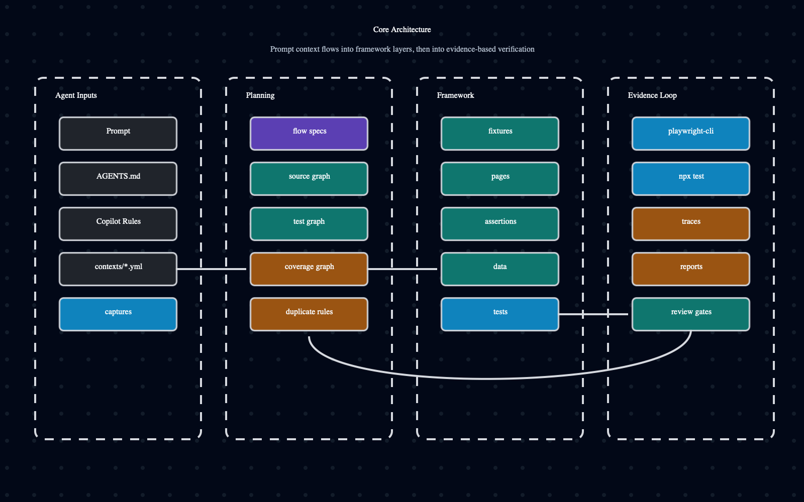

The rules are simple:

- tests assemble the flow
- page objects perform actions
- assertion helpers verify behavior
- fixtures own setup and injection
- data builders own reusable test data
- traces, screenshots, reports, and CLI output drive debugging

## Source-Aware Graph Intelligence

If the team has source access, the harness can analyze routes, roles, actions,
fields, states, tests, captures, and tags.

The important design choice is that the graph does not need to understand every
application directly.

It reads a **source manifest**.

That manifest is a simple contract:

- what routes exist
- which roles can access them
- which components or pages own them
- which user actions are visible
- which fields, validation states, empty states, loading states, and denied
  states matter
- which stable test IDs are available
- how auth context should be represented for capture workflows

The repo includes a common generic scanner that can create a first-pass
manifest from common React, Next, Angular, Vue, plain HTML, Spring Boot, and
.NET source patterns.

It looks for:

- route files and route declarations
- controller mappings
- links and router navigation
- labels, placeholders, and form fields
- buttons and submit handlers
- stable test IDs
- visible state hints such as loading, empty, error, validation, denied, and
  read-only
- role or guard hints when source code exposes them

That means a consuming team can start without writing a custom generator:

```bash
npm run source:manifest -- --root=path/to/app --output=source-manifest.json --url=http://localhost:3000 --name=my-app
```

The practical loop is:

```text
generic scanner creates baseline manifest
  -> agent reviews source, existing tests, captures, and graph gaps
  -> agent enriches missing auth, roles, states, and workflow intent
  -> capture workflow becomes curated reusable page context
  -> Playwright tests verify behavior
  -> graph reports remaining gaps and duplicate risks
```

The sample CRM app also includes a richer demo adapter that generates this
manifest from its source with exact seeded users and auth state. Real teams can
keep using the generic scanner, enrich the generated manifest, or provide their
own generator from their route config, source files, feature metadata, design
system registry, or test data model.

The command above uses the common scanner file:

```text
scripts/source-adapters/generic-source.mjs
```

For this sample repository, the richer CRM adapter is wired separately behind:

```bash
npm run source:manifest:crm
npm run source:manifest:crm:check
```

For non-sample applications, the common scanner should be the first path. A
team-owned command is only needed when the team already has a better manifest
producer:

```bash
SOURCE_MANIFEST_COMMAND="npm run app:manifest" npm run graph:view
```

Or when they want a custom adapter for extra precision:

```bash
SOURCE_MANIFEST_ADAPTER=tools/my-app-source-adapter.mjs npm run graph:view
```

That keeps the harness reusable. The framework consumes the manifest; each
application owns how that manifest is produced. The generic scanner removes the
first adoption bottleneck; app-specific generators improve precision when the
team needs it.

Run:

```bash
npm run graph:view
```

The generated graph report answers practical questions:

- What routes exist in the app?
- Which roles can access each route?
- Which routes already have tests?
- Which routes have curated captures?
- Which states are still missing?
- Which tests look duplicated or overlapping?
- Which page objects and assertion helpers are in use?

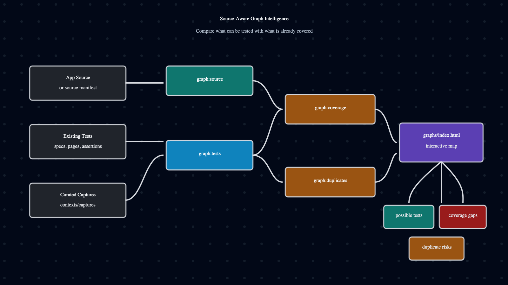

The HTML graph report is tabbed so it does not become a long scrolling page:

- Overview Map
- Route Coverage
- Gaps & Duplicates
- Candidate Tests
- Graph Inputs

Teams can open direct sections such as:

```text
graphs/index.html#coverage
graphs/index.html#candidates
graphs/index.html#inputs
```


## Example: Manager Role Coverage Improved

The sample CRM app includes:

- `/login`
- `/crm/dashboard`
- `/crm/leads`
- `/crm/accounts`
- `/crm/opportunities`
- `/crm/reports`
- `/crm/admin/users`

Roles:

- `admin`: full access
- `manager`: dashboard, accounts, opportunities, reports
- `sales`: dashboard, leads, opportunities
- `viewer`: read-only dashboard and accounts

The manager prompt added a useful graph loop:

```text
Before graph
  -> identify missing manager coverage
  -> generate/update manager capture workflow
  -> capture manager page states
  -> add page-object and assertion helpers
  -> add manager role tests
  -> rerun graph
```

Before manager tests, capture workflows, and manager captures:


After adding manager tests, capture workflows, and manager captures:


The graph loop showed:

| Metric | Before | After |
| --- | ---: | ---: |
| Covered routes | 5 | 7 |
| Coverage gaps | 10 | 2 |
| Curated captures | 9 | 18 |
| Test cases | 6 | 8 |

This is the proof point: the graph is not just a nice diagram. It gives
feedback on whether the prompt actually improved coverage.

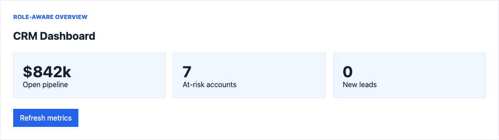

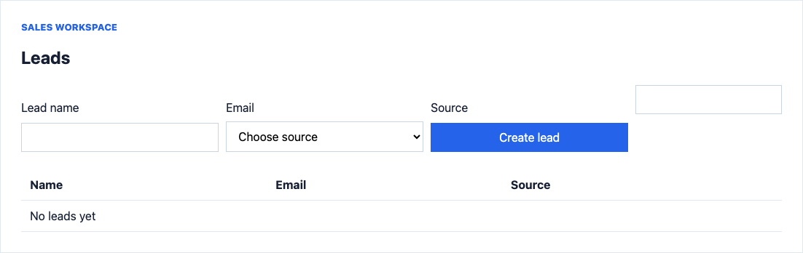

## How Teams Can Adopt This

Teams do not need to adopt everything at once.

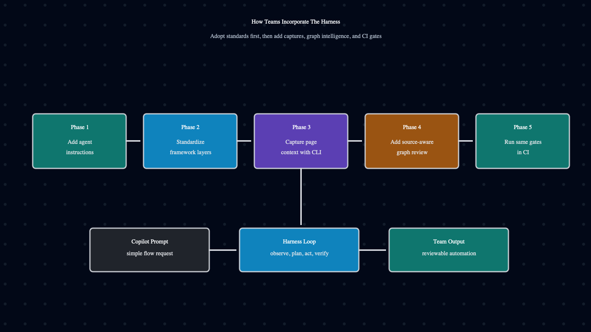

## Phase 1: Add Agent Instructions

Start with:

- `AGENTS.md`
- `.github/copilot-instructions.md`
- `contexts/command-map.yml`
- `contexts/test-strategy.yml`
- `contexts/agent-loop.yml`

This gives Copilot or another coding agent the operating model.

## Phase 2: Align The Playwright Framework

Create or align:

```text
specs/
tests/
fixtures/
pages/
assertions/
data/
contexts/captures/
```

Agree on the basics:

- accessible locators first
- stable test IDs when needed
- no fixed waits
- actions in page objects
- assertions in assertion helpers
- shared setup in fixtures
- tags for focused execution

## Phase 3: Add Capture Workflows

Install the global Playwright agent CLI where approved:

```bash
npm install -g @playwright/cli@latest
```

Then make capture workflows the default path instead of asking users to
remember raw `playwright-cli open`, `snapshot`, or `screenshot` commands.

For this sample repo, the CRM manager workflow looks like this:

```bash
npm run capture:recipes:generate
npm run capture:recipe -- --list
npm run capture:crm:manager -- --dry-run
npm run capture:crm:manager
```

In a real project, teams would generate equivalent workflows for their own
roles, pages, and business flows.

Use raw `playwright-cli` commands only for unusual one-off exploration or when
creating a brand-new workflow pattern.

## Phase 4: Add Graph Review

Run the graph before broad test creation:

```bash
npm run graph:view
```

Before adding a test, ask:

- is this route already covered?
- is this role already covered?
- is this state still missing?
- is there already a capture?
- is this a duplicate or a valid new dimension?

## Phase 5: Use The Same Commands In CI

Agents and CI should share the same verification commands:

```bash
npm run typecheck
npm test
npm run test:smoke
npm run graph:view
```

That makes agent-generated tests reviewable and CI-compatible from the start.

## Prompt Examples Teams Can Use

The goal is not to make users write long procedural prompts.

Users should give intent. The harness supplies the process.

New flow:

```text
Use the harness to add coverage for this role-based business flow.
```

What the harness makes the agent do:

```text
check MCP access
refresh or read the source manifest
inspect existing specs, tests, captures, and graph coverage
use MCP agents or the relevant capture workflow
reuse framework layers
run focused Playwright tests
update the graph
report evidence
```

Debugging:

```text
Use the harness to debug this failing test.
```

What the harness makes the agent do:

```text
inspect Playwright output, trace, and artifacts
check existing captures for the affected page or state
refresh source manifest or affected capture only if stale
fix the owning layer
rerun focused verification
```

Coverage review:

```text
Use the harness to review missing coverage.
```

What the harness makes the agent do:

```text
refresh or read the source manifest
run graph view
identify missing role, state, route, capture, and assertion coverage
check duplicate risks
recommend next flows
avoid creating tests unless asked
```

Refactoring:

```text
Use the harness to refactor repeated selectors and assertions.
```

What the harness makes the agent do:

```text
inspect existing tests, page objects, and assertion helpers
preserve behavior
move repeated selectors to page objects
move repeated expectations to assertion helpers
run typecheck and focused tests
update graph if coverage ownership changed
```

## What Teams Get

The harness gives teams:

- short intent prompts that can become framework-aligned tests
- source-aware test case suggestions before writing new scripts
- coverage-gap signals for missing routes, roles, states, and captures
- MCP support when available
- a no-MCP fallback when MCP is blocked
- reusable page context through capture workflows
- lower duplicate-test risk
- better fixture, page-object, and assertion consistency
- trace-first debugging habits
- graph-based planning and review feedback
- CI-friendly verification

The real benefit is not just faster Playwright test generation.

The real benefit is a governed testing loop: discover candidate tests, create
the right ones from short prompts, avoid duplicates, verify with Playwright
evidence, and keep the resulting automation reviewable.

## Final Thought

Agentic UI testing is not only about giving an AI access to a browser.

It is about giving the AI a reliable operating model:

```text
prompt
  -> mode router
  -> context
  -> capture workflow or MCP exploration
  -> framework layers
  -> Playwright verification
  -> evidence
  -> graph feedback
```

With MCP, the harness becomes governance around powerful Playwright Agents.

Without MCP, it becomes a practical CLI-driven path for prompt-based test
creation and healing.

With source access, it becomes a graph-based way to see what is covered, what is
duplicated, and what is still missing.

That is the goal: better Playwright test systems, not just more Playwright
tests.

## References

- Playwright Test Agents: https://playwright.dev/docs/test-agents
- Playwright MCP: https://playwright.dev/docs/getting-started-mcp
- Playwright Agent CLI: https://playwright.dev/docs/getting-started-cli
- Playwright CLI: https://playwright.dev/docs/test-cli
- Playwright authentication: https://playwright.dev/docs/auth
- Playwright fixtures: https://playwright.dev/docs/test-fixtures
- Playwright annotations and tags: https://playwright.dev/docs/test-annotations
- Playwright best practices: https://playwright.dev/docs/best-practices
