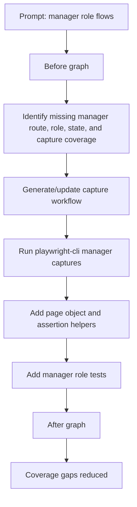
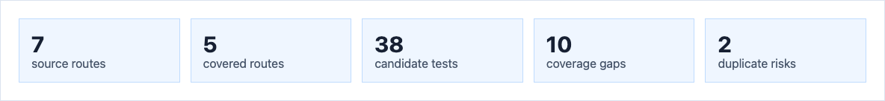
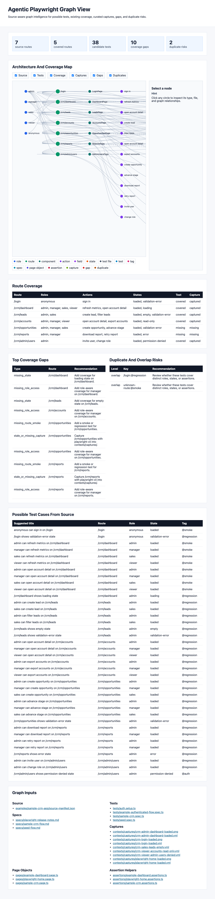
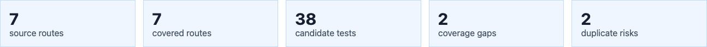
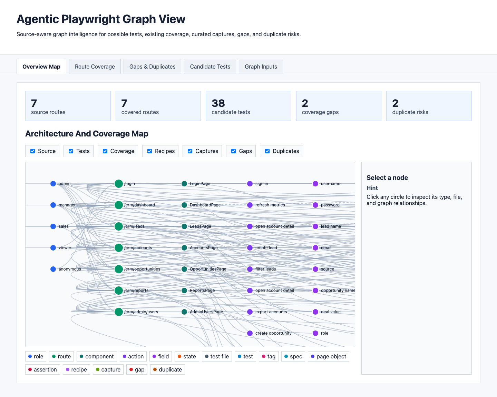

# Manager Flow Graph Loop Evidence

This evidence pack shows how the graph loop changes before and after adding
manager role coverage, capture workflows, and curated Playwright CLI captures.

## Scenario

Prompt:

```text
Use the harness framework and create tests for manager role flows and assert for
viewable/accessible buttons and not accessible buttons.
```

Graph loop:



## Before

Baseline commit: `d80ea9a`.

State: before manager flow tests, capture workflows, manager captures, and workflow
graph nodes.





## After

State: after adding manager role test coverage, V3 capture workflows, manager
captures, workflow graph nodes, and the tabbed graph-report UI.





## Improvement

| Metric | Before | After | Change |
| --- | ---: | ---: | ---: |
| Source routes | 7 | 7 | 0 |
| Covered routes | 5 | 7 | +2 |
| Candidate tests | 38 | 38 | 0 |
| Coverage gaps | 10 | 2 | -8 |
| Duplicate risks | 2 | 2 | 0 |
| Curated captures | 9 | 18 | +9 |
| Test cases | 6 | 8 | +2 |

Closed gaps:

- Manager role access on `/crm/dashboard`.
- Manager role access on `/crm/accounts`.
- Route coverage for `/crm/opportunities`.
- Capture coverage for `/crm/opportunities`.
- Manager role access on `/crm/opportunities`.
- Route coverage for `/crm/reports`.
- Capture coverage for `/crm/reports`.
- Manager role access on `/crm/reports`.

Remaining gaps:

- Loading state coverage on `/crm/dashboard`.
- Empty state coverage on `/crm/leads`.

## Reproduction Commands

Before evidence:

```bash
git worktree add /tmp/playwright-harness-before d80ea9a
cd /tmp/playwright-harness-before
npm run graph:view
```

After evidence:

```bash
npm run capture:recipes:generate
npm run capture:crm:manager
npm run graph:view
APP_BASE_URL=http://127.0.0.1:4173 npm run sample:crm:test
```

The screenshots above are retained as the historical evidence artifact. The
current graph data should be regenerated with `npm run graph:view`.
